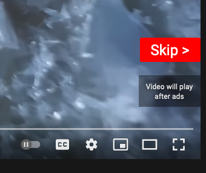
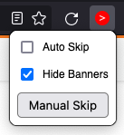

# What it does

- Adds a red skip button [1] to ads on YouTube, or
- Automatically skips YouTube ads
- Automatically hides YouTube ad banners
- Allows to skip ads on any other website

# How to use

skipButton.js can be installed through the [Chrome Webstore](), [Addons for Firefox]() or downloaded from the [releases page]() and installed manually.

When the extension is active, the red skip button will appear whenever there is a YouTube ad playing.
On other websites, ads can be skipped with the Manual Skip button in the extension popup menu.

There are two settings which can be accessed through the popup: 
- *Auto Skip* causes YouTube ads to be skipped without requiring the skip button to be pressed
- *Hide Banners* causes YouTube ad banners to be closed automatically

The *Manual Skip* button attempts to skip any video currrently being played on the page, allowing ads to be skipped on any other website.

[1]      | [2]
:-------:|:-------:
 | 
