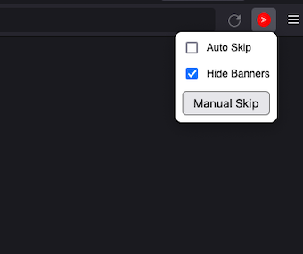

# What it does

- Adds a red skip button [1] to ads on youtube, or
- Automatically skips ads
- Automatically hides ad banners
- Allows to skip ads on any other website

# How to use

skipButton.js can be installed through the [Chrome Webstore](), [Addons for Firefox]() or downloaded from the [releases page]() and installed manually.

It has two settings which can be accessed through its popup menu [2]:
- *Auto Skip* causes youtube ads to be skipped without requiring the skip button to be pressed
- *Hide Banners* causes youtube ad banners to be closed automatically

The *Manual Skip* button attempts to skip any video currrently being played on the website, allowing ads to be skipped on any other website.

[1]      | [2]
:-------:|:-------:
 | 
